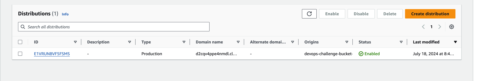
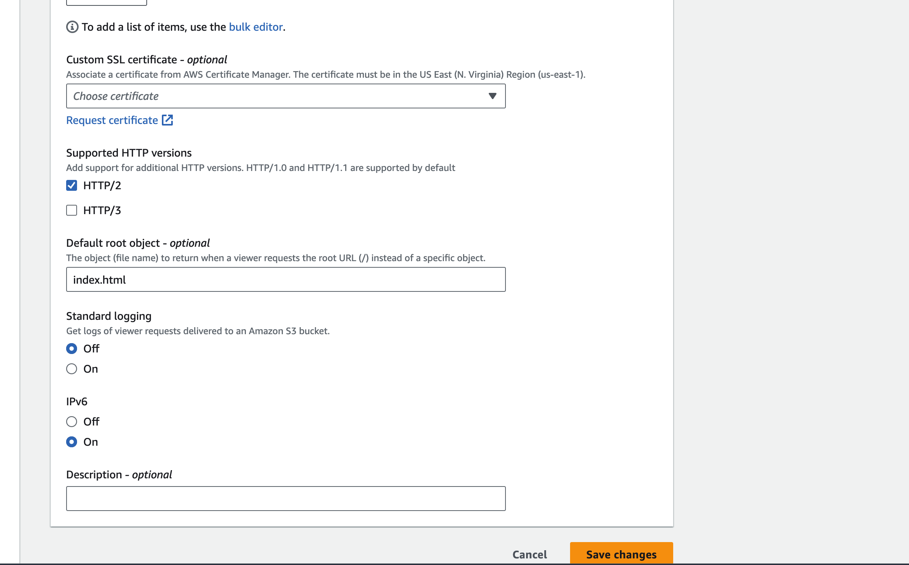
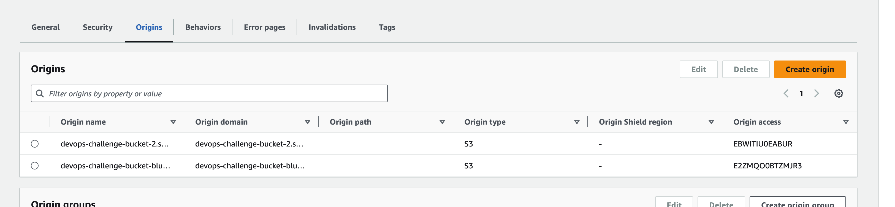
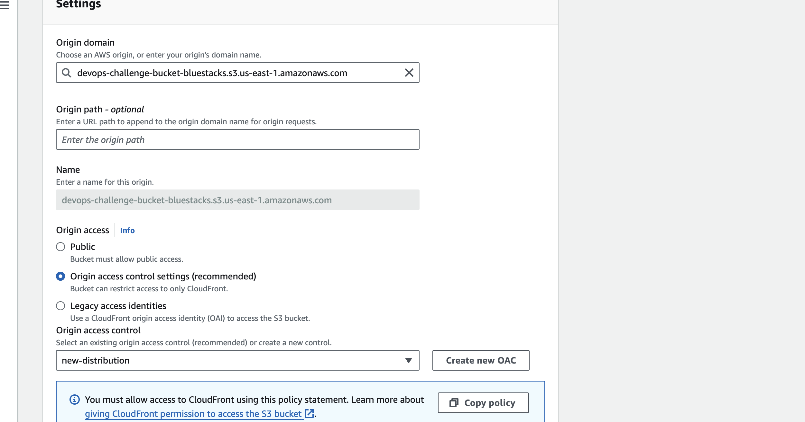
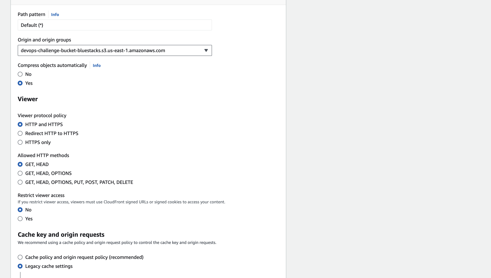
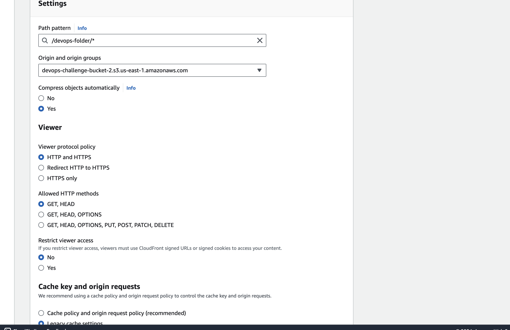
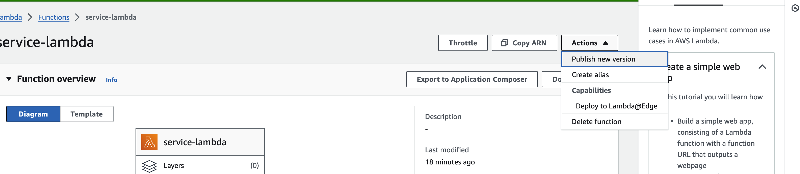
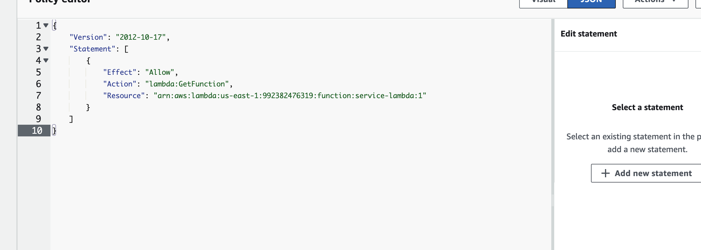

## ASSIGNMENT 1 - CloudFront CDN and S3 Bucket
##### AUTHOR - TANUJ ARORA
##### DATE - 19 July 2024
----
### Create a Bucket for Root Object
1. Upload the index.html in the root directory


### Create a second bucket for Devops-Folder
1. Create a devops-folder
2. Upload the index.html inside the devops-folder.
3. Make sure you have the public access disabled for security reasons.


4. Create a CloudFront Distribution

5. Add the root object for the distribution.

6. Add the origin for both S3 Buckets. 

7. Create an Origin access identity for the distribution

8. Add Behaviours for both the S3 Buckets.


9. For /devops-folder/ to direct to index.html file we need to create a lambda@edge function to update the request url.
```python
def lambda_handler(event, context):
    request = event['Records'][0]['cf']['request']
    uri = request['uri']
    if uri.endswith('/devops-folder/'):
        request['uri'] = uri + 'index.html'
    return request
test_event = {
    'Records': [{
        'cf': {
            'request': {
                'uri': '/devops-folder/'
            }
        }
    }]
}


# print(lambda_handler(test_event, None))

```
10. Create a new version for the edge function to be used.


11. Add the custom policy for the lambda function.

12. Update the Trust Relationships for the edge function.
```json
{
    "Version": "2012-10-17",
    "Statement": [
        {
            "Effect": "Allow",
            "Principal": {
                "Service": [
                    "lambda.amazonaws.com",
                    "edgelambda.amazonaws.com"
                ]
            },
            "Action": "sts:AssumeRole"
        }
    ]
}
```

## FINAL RESULT
#### BROWSER OUTPUT
##### Root object

##### Devops-Folder

#### CURL COMMAND
