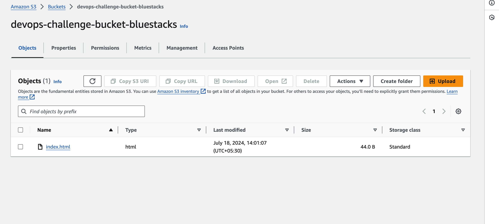
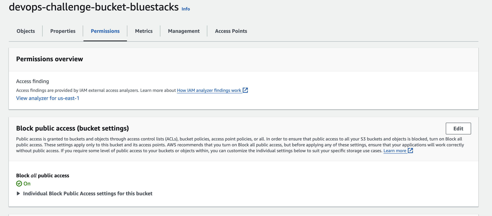
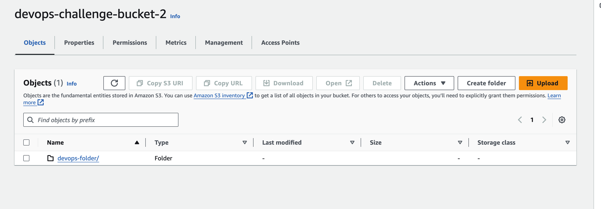
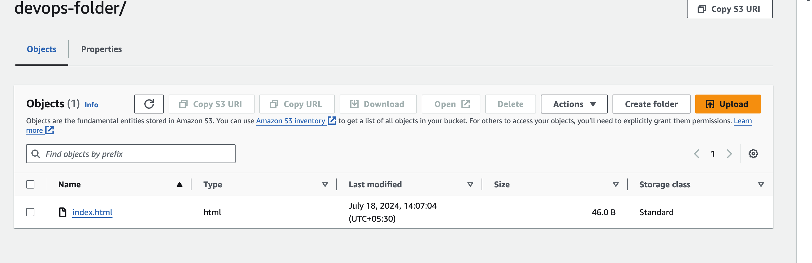
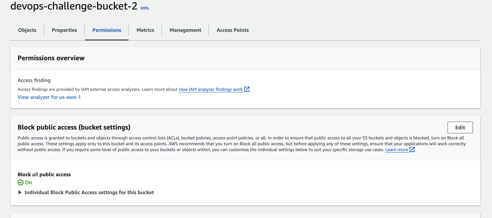
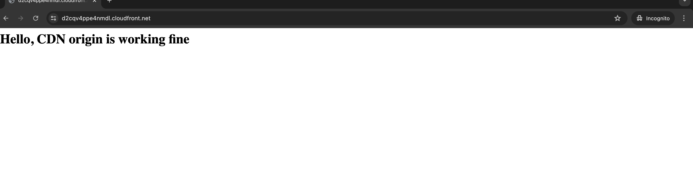
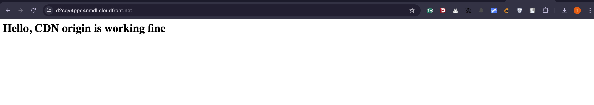
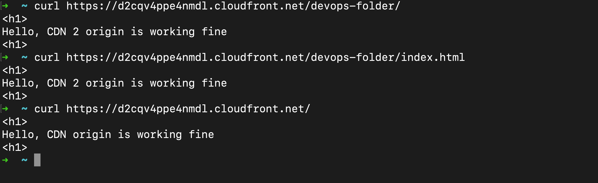

## ASSIGNMENT 1 - CloudFront CDN and S3 Bucket
##### AUTHOR - TANUJ ARORA
##### DATE - 19 July 2024
----
### Create a Bucket for Root Object
1. Upload the index.html in the root directory

### Create a second bucket for Devops-Folder
1. Create a devops-folder
2. Upload the index.html inside the devops-folder.
3. Make sure you have the public access disabled for security reasons.

### FINAL RESULT
#### BROWSER OUTPUT
##### Root object

##### Devops-Folder

#### CURL COMMAND
