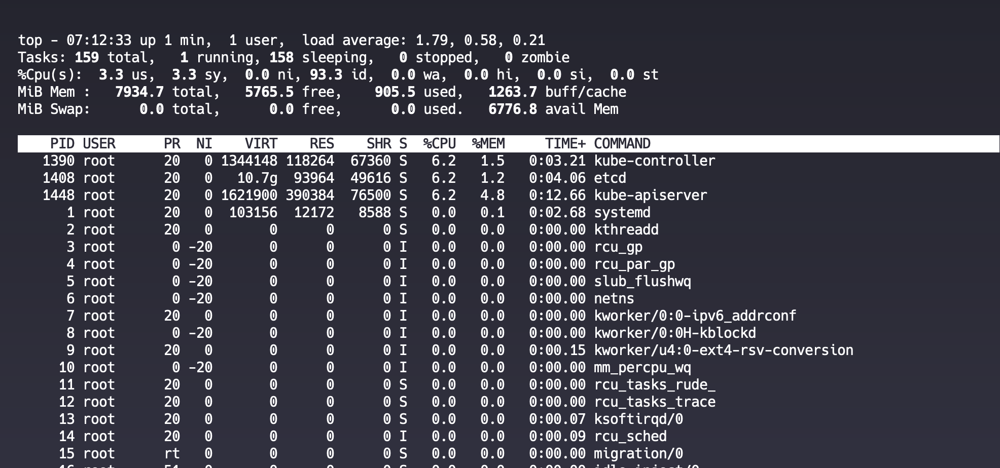
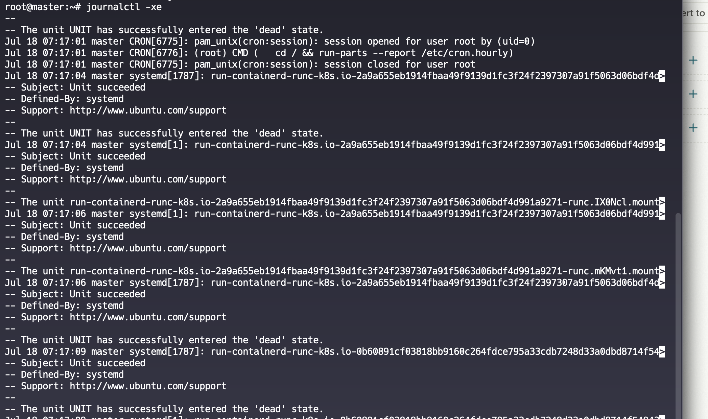

<!-- A client has a Linux server that has just paged you because of a high load average issue. Upon connecting and running uptime you see: 12:20:50 up 1 day, 10:52, 6 users, load average: 44.28, 33.34, 30.44 How would you troubleshoot this issue to find out what is the source of the load and what tools would you use? Please also list what you would look for in the output of the commands you would run. -->

### COMMANDS TO INVESTIGATE
#### Check the Uptime and Average Load Average
```sh
uptime
```

#### Check Proccess Tables and Running Process

```sh
top
```
#### Check if the swap memory is high
```sh
free -gh
```

#### Check the PID's of the Top Process for Troubleshooting
```sh
ps -eo pid,ppid,cmd,%mem,%cpu --sort=-%cpu | head

```


#### Check for memory blockage and Usage
```sh
vmstat
```


#### Check for System Logs
```sh
journalctl -xe
```
